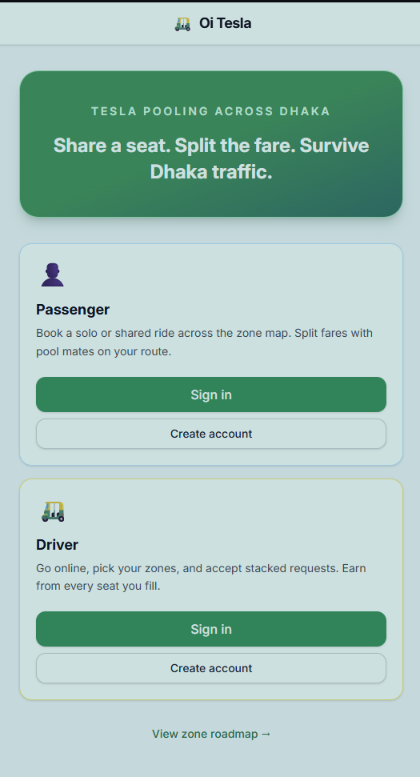
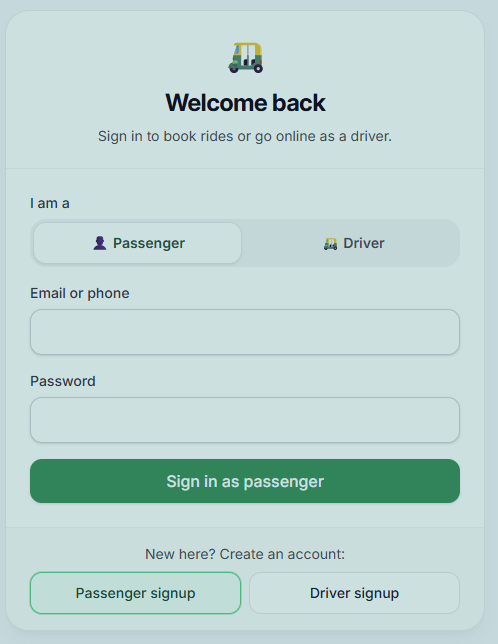
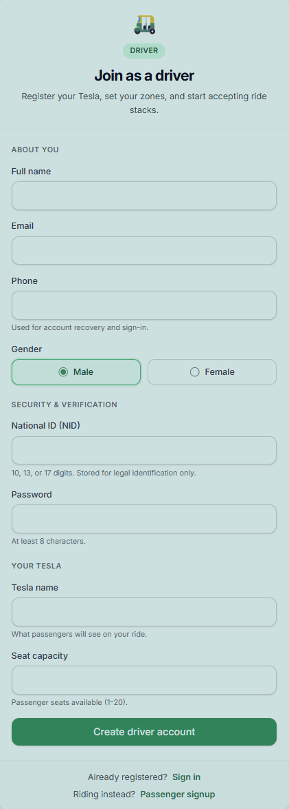
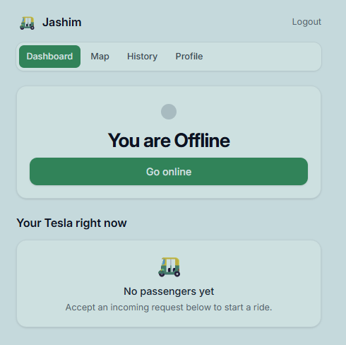
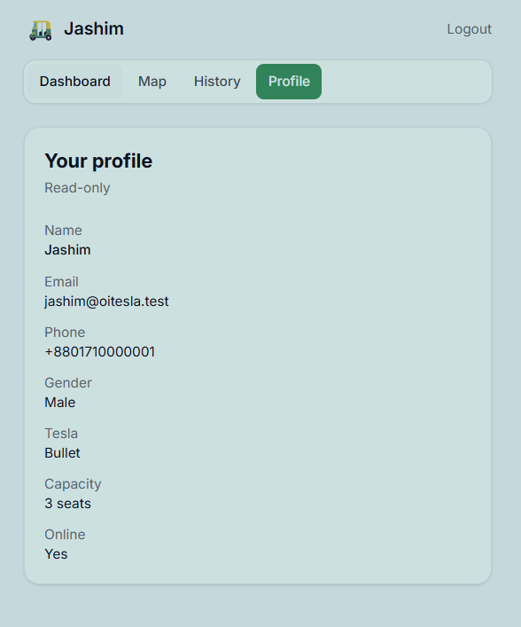
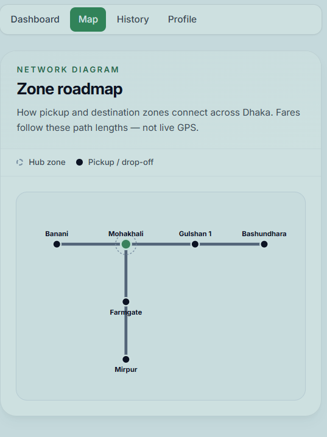
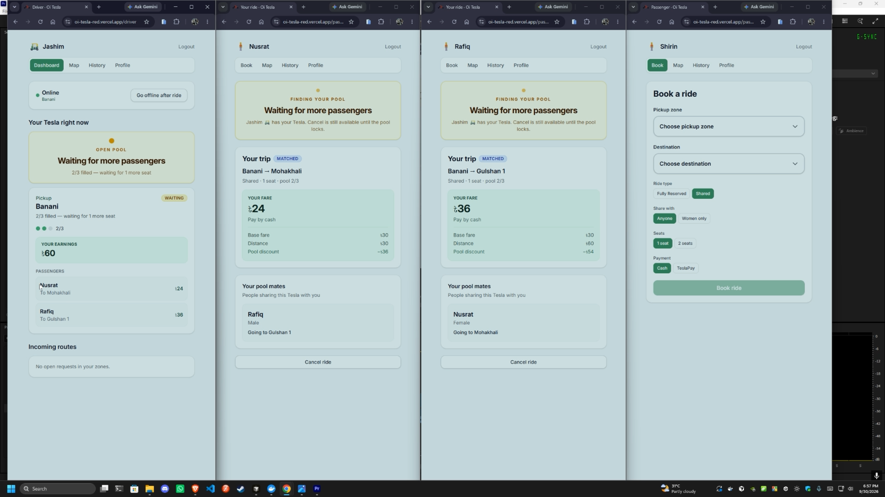
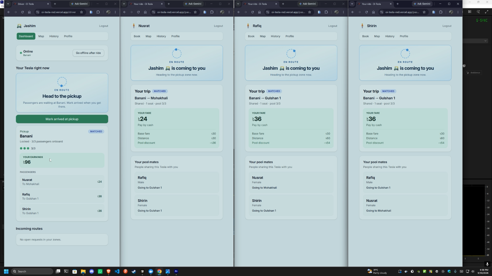
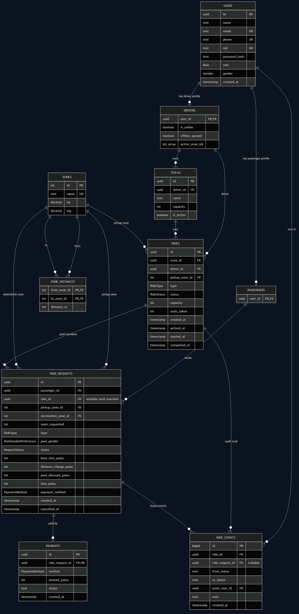
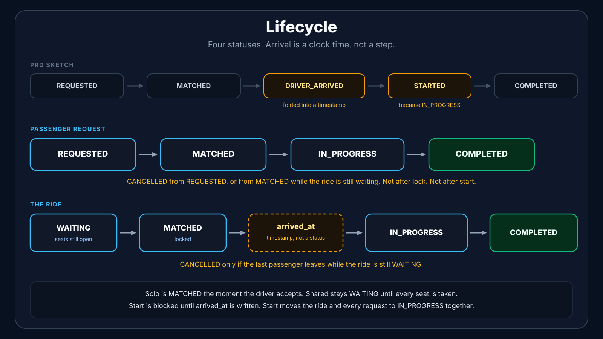

# Oi Tesla

Share a seat. Split the fare. Survive Dhaka traffic.

Oi Tesla is a ride-pooling MVP for a three-seat battery Tesla named Bullet. Passengers book a solo seat or share one. The driver sees who is actually riding, accepts a whole stack when the routes fit, and walks the trip from arrival to completion. The system keeps an audit of what happened.

**Live app:** https://oi-tesla-red.vercel.app/

The frontend is on Vercel. The API is on Render's free tier, so a cold start can take 30–60 seconds. If login or signup looks stuck, wait. The server is waking up.

**Demo video:** https://youtu.be/SCFxq7xm_J0

## The problem

8:41 AM, Banani Road 11. Nusrat needs Mohakhali. Rafiq, a stranger, needs Gulshan 1. Both start in Banani. Jashim's Bullet has three seats. The product has to decide, quickly and fairly:

- Can these two share a Tesla even though the destinations are not identical?
- What does each person pay, and can a human check that number by hand?
- How does Jashim know who is on the ride, and when he is allowed to leave?
- What happens when Shirin races for the last seat at the same moment as someone else?
- After the ride, can we still explain the fare, the pool, and every status change?

Real maps, live traffic, and a payment gateway are out of scope. The engineering problem is the pool: capacity, compatible routes, individual fares, and a lifecycle that does not lie.

## What is built

| Home | Login | Driver signup |
| --- | --- | --- |
|  |  |  |

| Offline | Profile | Zone roadmap |
| --- | --- | --- |
|  |  |  |

| One seat left | Pool full |
| --- | --- |
|  |  |

**Passenger**

- Sign up and sign in with email or phone. National ID is required at signup and stored for accountability. It is never shown back in the API or the UI.
- Book a ride: pickup zone, destination zone, solo or shared, one or two seats, cash or simulated TeslaPay.
- See a fare preview before confirming. Shared bookings can be open to anyone, or limited to the passenger's own gender. The opposite gender is not a choice.
- Track the request from searching, to matched, to the driver arriving, to in progress, to completed or cancelled.
- See pool mates as name, gender, and destination only. No fare, no phone, no NID.
- Cancel while the request is still valid. View finished and cancelled trips.

**Driver**

- Sign up with a named Tesla and a seat capacity. Sign in, pick active zones, go online.
- See incoming requests grouped into stacks of the same compatible route, with the total fare for the stack.
- Accept one request or the whole stack. Mark arrival, start the ride, complete it.
- See each passenger's name, destination, and fare. Gender is not shown to the driver.
- Go offline only after the current ride finishes. Ride history is the audit, not a second source of truth.

**Pool**

- Several shared requests can attach to one ride. A solo ride never takes a second passenger.
- Occupied seats never exceed the Tesla's capacity, including when two people try to take the last seat together.
- Each passenger stores and sees their own fare.
- A closer destination can join a ride that is already going farther along the same road. Booking order does not decide who is "on the way."

## Architecture

One browser app, one API, one database. No microservices, no Kafka, no Redis, no queues. Those would make the diagram look larger and the ride logic harder to trust.


The browser runs a React Router app. Passenger and driver screens load their data through route loaders and call a single Express API. The API checks the JWT, runs fare, pooling, and lifecycle rules, and is the only process allowed to write the database. Prisma talks to Postgres. Live ride screens poll the API every few seconds. That is enough for this MVP, and it keeps "what is the ride status right now?" as a normal HTTP read.

Deployed shape: the frontend is on Vercel, the API is a Docker web service on Render, and Postgres is Neon. `prisma migrate deploy` runs when the API container starts.

## Database



| Table | Why it exists |
| --- | --- |
| `users` | The person. Name, email, phone, NID, password, role, gender. |
| `drivers` | Driver-only fields: online, queued to go offline, active zones. A Tesla and a ride point here, so a passenger account cannot be assigned a trip. |
| `passengers` | Only a user id. Bookings point at this row, not at `users`, so a driver account cannot book a seat. |
| `teslas` | The vehicle. `capacity` is the seat limit. |
| `zones`, `zone_distances` | Named places, and the meters between them in both directions. Fares and "on the way" use this. |
| `rides` | One trip on one Tesla. Status, `seats_taken`, and `arrived_at`. |
| `ride_requests` | One booking. Its own fare, destination, solo or shared, and pool gender. Linked to a ride once it is matched. |
| `payments` | Cash or TeslaPay for that booking. Nothing is actually charged. |
| `ride_events` | Every status change, including arrival. Ride history is read from here. |

Money is integer paisa. A fare of 24 BDT is stored as `2400`. Integer math does not drift the way decimal money does in application code.

## Fare model

```
base_fare = 3000
distanceCharge = round(kilometers × 1500 paisa)
subtotal       = base_fare + distanceCharge
shared         = subtotal − round(subtotal × 0.60)

solo           = subtotal
pool fare      = per-seat fare × seats booked
```

Shared rides take 60% off the per-seat price, then multiply by 1 or 2 seats. A solo booking never gets the pool discount, and it always books one seat.

Seed distances on the rush-hour road:

| Trip | Path | Shared fare | Solo fare |
| --- | --- | --- | --- |
| Nusrat, Banani → Mohakhali | 2 km | 24 BDT | 60 BDT |
| Rafiq, Banani → Gulshan 1 | 4 km | 36 BDT | 90 BDT |

Mohakhali sits on the Banani → Gulshan 1 road, so those two shared bookings can share Bullet. Farmgate does not, so it will not be dropped onto that ride.

## Lifecycle



The PRD sketch was `REQUESTED → MATCHED → DRIVER_ARRIVED → STARTED → COMPLETED`, plus `CANCELLED`. I kept four statuses and made arrival a timestamp.

A request goes `REQUESTED → MATCHED → IN_PROGRESS → COMPLETED`. The passenger can cancel from `REQUESTED`, and from `MATCHED` only while the ride is still `WAITING`. After the ride locks, or after it starts, cancel is rejected.

The ride is a second chain. A shared ride stays `WAITING` until every seat is taken, then becomes `MATCHED`. A solo ride is `MATCHED` the moment the driver accepts. Arrival does not change the status. It writes `rides.arrived_at` and a `ride_events` row noted `driver_arrived`. The driver cannot start until that time is set. Start moves the ride and every matched request to `IN_PROGRESS` together. Complete moves both to `COMPLETED`.

The ride itself becomes `CANCELLED` only if the last passenger leaves while it is still `WAITING`.

## The last seat

Bullet has one seat left. Nusrat and Shirin both still see it. Both tap at once.

Acceptance runs inside a Postgres transaction. The ride row is locked with `SELECT … FOR UPDATE` before `seats_taken` is incremented. The second transaction waits, re-reads the locked row, sees the seat is gone, and fails. Capacity is checked again under the lock, not against the number the browser showed. The same lock protects cancellations that give a seat back.

That is the right tool at this size. At a much larger size I would keep the row lock for the actual seat claim, and put matching candidates in a queue so the API is not holding a transaction open while it searches.

## Tech stack

React Router, Express, Postgres. That is the whole app.

| Piece | Choice |
| --- | --- |
| Frontend | React Router |
| API | Express, with Zod on the request body |
| Database | Postgres, through Prisma |
| Auth | JWT in `sessionStorage` |
| Tests | Vitest and Supertest |
| UI | Tailwind |
| Hosting | Vercel, Render, Neon |

React Router because each screen is a route with a loader, and that loader is where the page gets its data. Server rendering stays on. The Docker image and the Vercel deploy both serve that build, so turning it off would have broken them.

Express because there is one API. A bad body fails in Zod before it reaches a service.

Postgres because two people can tap the last seat at the same time. The accept runs in a transaction and locks the ride row. Prisma holds the schema, the migrations, and the seed.

The token carries the role. A driver token cannot open a passenger route. `sessionStorage` is fine for this demo. I would not ship a real login that way.

The tests hit the real API and a real database: fares, capacity, cancel, gender pools, and the last seat.

Vercel serves the frontend, Render runs the API container, Neon is Postgres. `docker compose up` runs the same three pieces on a laptop.

## Project structure

```
backend/          Express API, Prisma schema, migrations, seed, tests
frontend/         React Router app
docs/             Architecture diagram, ERD, and lifecycle
docker-compose.yml
.env.example
```

## Prerequisites

- Node.js 22+
- Docker, if you want the one-command stack
- A Postgres 16 database if you run the API on the host instead

## Environment variables

Copy `.env.example` to `.env` at the repo root for Docker. Copy `backend/.env.example` to `backend/.env` for a host-run API. Never commit those copies.

| Variable | Where | What it is |
| --- | --- | --- |
| `POSTGRES_USER`, `POSTGRES_PASSWORD`, `POSTGRES_DB` | root `.env` | Docker Postgres |
| `DATABASE_URL` | API | Postgres connection string |
| `JWT_SECRET` | API | Signing secret. Long, random, not the example value. |
| `JWT_EXPIRES_IN` | API | Token lifetime. Seeded demo uses `7d`. |
| `PORT` / `API_PORT` | API | API port. Default `3001`. |
| `VITE_API_URL` | frontend build | Public API origin, no trailing slash. Local `npm run dev` can omit it and proxy `/api` to `localhost:3001`. |
| `API_URL` | frontend server | Server-side fetch target. Docker sets `http://api:3001`. |

## Run it locally

**Docker**

```bash
docker compose up --build
```

- App: http://localhost:3000
- API health: http://localhost:3001/api/health
- Postgres: `localhost:5432`

The API container applies migrations on startup. Seed the story cast once:

```bash
docker compose exec api npx prisma db seed
```

**Without Docker**

```bash
# terminal 1 — Postgres already running
cd backend
cp .env.example .env
npm install
npx prisma migrate dev
npx prisma db seed
npm run dev

# terminal 2
cd frontend
npm install
npm run dev
```

- App: http://localhost:5173
- API: http://localhost:3001

## Tests

```bash
cd backend
npm test
```

They need `DATABASE_URL` in `backend/.env`. The suite covers Bullet's capacity, invalid status changes, Nusrat and Rafiq's pooled fares, a passenger touching someone else's ride, cancellation, gender-specific pools, and two concurrent claims on the last seat.

## Demo cast

Password for every account: `password123`

| Who | Email | Role |
| --- | --- | --- |
| Jashim | jashim@oitesla.test | Driver. Tesla: Bullet, 3 seats. |
| Nusrat | nusrat@oitesla.test | Passenger. Banani → Mohakhali in the story. |
| Rafiq | rafiq@oitesla.test | Passenger. Banani → Gulshan 1. |
| Shirin | shirin@oitesla.test | Passenger. The last-seat race. |

NID on the seeded users is `1000000001` through `1000000004`. A new signup needs a real-shaped NID: 10, 13, or 17 digits.

## API overview

All routes are under `/api`. Authenticated routes expect `Authorization: Bearer <token>`.

| Method | Path | Who |
| --- | --- | --- |
| `GET` | `/health` | public |
| `POST` | `/auth/passenger/register`, `/auth/passenger/login` | public |
| `GET` | `/auth/passenger/me` | passenger |
| `POST` | `/auth/driver/register`, `/auth/driver/login` | public |
| `GET` | `/auth/driver/me` | driver |
| `GET` | `/zones` | public |
| `POST` | `/ride-requests/estimate`, `/ride-requests` | passenger |
| `GET` | `/ride-requests/mine`, `/ride-requests/history`, `/ride-requests/:id` | passenger |
| `GET` | `/ride-requests/:id/pool-mates` | passenger |
| `POST` | `/ride-requests/:id/cancel` | passenger |
| `PATCH` | `/driver/status` | driver |
| `GET` | `/driver/requests` | driver, grouped stacks |
| `POST` | `/driver/request-stacks/accept` | driver |
| `POST` | `/driver/requests/:requestId/accept` | driver |
| `GET` | `/driver/rides`, `/driver/rides/history`, `/driver/rides/:rideId` | driver |
| `PATCH` | `/driver/rides/:rideId/arrive`, `/start`, `/complete` | driver |

## Decisions I would defend

- **Zones, not a map API.** Matching uses a seeded distance matrix and a corridor check: A is compatible with B when one destination lies on the path from the shared pickup to the other. Nusrat and Rafiq share. A Mirpur booking does not join that ride.
- **Driver accepts.** A shared request does not silently become a trip. Jashim accepts the stack. That matches "the driver needs to know who is riding before he goes."
- **Gender is a pooling constraint, not a profile card.** Passengers may share with anyone or with their own gender. Pool mates see gender. Drivers do not.
- **NID is write-only.** It exists so a user can be identified later. It is not part of the ride screen.
- **Polling, not sockets.** A 3 second refresh is boring and correct. A socket layer would be a second system to explain for the same status field.

## Challenges

The Render build died on types before the container could start. Express 5 types `req.params.id` as `string | string[]`. The ride-request handlers passed that into functions that want a plain string. The driver ride controller already had a helper for it. I used the same helper, and the image built.

Tabs on the live site felt slow. Each tab asked for a route manifest, then the loader called the API one request after another. The book page did zones, then the profile, then the ride. I nearly turned server rendering off to make it a plain client app. That would have broken Docker and Vercel, which both serve the React Router server build. I shipped every route in the first document, prefetched the tab code, ran those loader calls together, and cached zones and the passenger profile for the session. The live ride is still fetched fresh.

NID was a column, a migration, and a field on the form. Signup then returned 500. The database had the column. The API process that was already running still had the old Prisma client and did not know `nid` existed. I stopped it, ran `prisma generate`, and started it again. Signup also rejects a duplicate email, phone, or NID.

The first diagram I drew had no `passengers` table. A booking does not point at `users`. It points at `passengers.user_id`. The table only holds that id. It exists so a driver account cannot book a seat. Rides point at `drivers` so a passenger cannot be handed a Tesla.

Cancel was sloppy at first. Giving a seat back did not lock the ride row, so an accept already in flight could still take it, and two cancels could push `seats_taken` below zero. Cancel now uses the same `FOR UPDATE` lock as accept. The second transaction waits and reads the row again.

A women-only request could land in a stack that already had a man, because the check only looked at the new booking. Both sides are checked now. The person joining has to accept everyone already on the ride, and they have to accept the person joining.


## Known limits

- No live GPS. The zone map is a diagram, and fares use the seeded meters.
- TeslaPay is a label on the payment row. Nothing is charged.
- The JWT lives in `sessionStorage`. Fine for the demo. Not what I would ship to real riders.
- Live screens poll. A passenger can be a few seconds behind the driver's tap.
- The Render API sleeps on the free tier. The first login or signup after idle can take 30–60 seconds. That is hosting, not the pool logic.
- There is no password reset, ratings, or in-app chat. They were not the MVP.

## Later

One thing I would add after this submission, not inside it.

A PWA, so the site can be installed on a phone. The service worker would only be there for the install prompt. It would not cache `/api` or ride status.


## If this went viral

One million passengers and a hundred thousand drivers breaks the "one Node process polls Postgres" story. I would not start by splitting into microservices.

1. Keep the API stateless and put more than one copy behind a load balancer.
2. Leave seat claims on the primary, still under a row lock. Add a short idempotency key on accept so a retried tap cannot double-book.
3. Index the matching read: open requests by pickup zone, status, and ride type. A replica can serve history and zone reads. It must not serve the seat claim.
4. Cache the zone matrix. It barely changes. But we do not cache `seats_taken`.
5. Push matching off the request: a worker consumes "request created" and "driver online" events, writes a candidate stack, and the driver still accepts.
6. Replace the 3 second poll with a single ride-status channel once the poll traffic dominates.
7. Rate-limit login and booking. Log request ids, pool decisions, and lock failures so a bad fare is explainable.
8. Geospatial search replaces the zone list only when pickups stop being "Banani" and start being a pin on Road 11.

## Assumptions

- Dhaka is a handful of named zones with fixed distances. Good enough to test Nusrat and Rafiq. Not a router.
- A passenger may book two seats for their own party. Those seats count against Bullet immediately.
- A driver going offline mid-ride finishes the ride first.
- Arrival can happen before the Tesla is full, but start cannot happen before arrival.
- "Compatible route" means the corridor rule above, not "destinations within N meters."

## AI usage

I used Cursor as the main coding partner, plus the Prisma, React Router, and Express docs when I needed the exact API.

One suggestion I kept: store NID on the user and keep it out of every response mapper. The accountability requirement is real. Showing the number on a pool-mate card would have been the opposite of the privacy rules already in the app.

One suggestion I rejected: turn the frontend into a pure SPA to make tab changes faster. The Docker image and the Vercel deploy both serve the React Router server build. The slow part was sequential API calls and a lazy route manifest, so I fixed those and left server rendering in place.

## How to watch the story

1. Sign in as Nusrat. Book Banani → Mohakhali, shared, one seat.
2. Sign in as Rafiq in another browser. Book Banani → Gulshan 1, shared and book 2 seats.
3. Sign in as Jashim. Go online around Banani. Accept the stack. Mark arrival, then start, then complete.
4. For the edge case, leave one seat and have Nusrat and Shirin request it together. One of them gets the seat. The other gets a clear failure, and `seats_taken` stays inside Bullet's capacity.
